# Procesverslag
**Auteur:** -Pieter Buur-

Codepen: https://codepen.io/pieterbuur/pens/public?cursor=ZD0wJm89MSZwPTEmdj00NzE3MzIyNQ==

## Bronnenlijst
1. -Flexbox- https://css-tricks.com/snippets/css/a-guide-to-flexbox/
2. -Media queries- https://robinroelofsen.nl/responsive-websites-media-queries
3. -Micro Interactie- https://www.youtube.com/watch?v=xuA83OYTE7I&ab_channel=dcode
4. -2e video Micro Interactie- https://www.youtube.com/watch?v=s_hO8Pn3u5M&t=92s&ab_channel=ProMakerDev

## Eindgesprek (week 7/8)
-

**Screenshot(s):**

-screenshots van het eindresultaat-

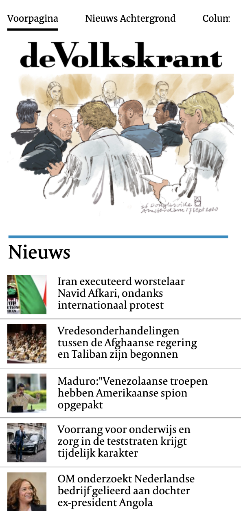
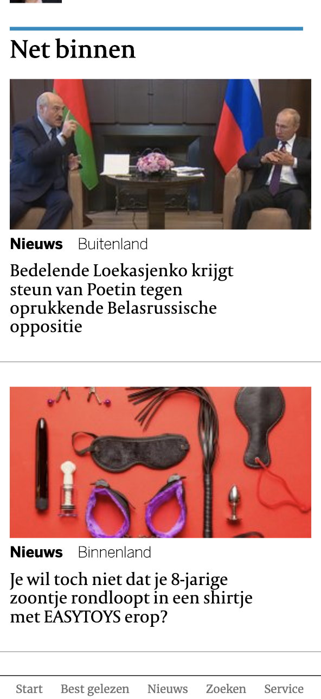
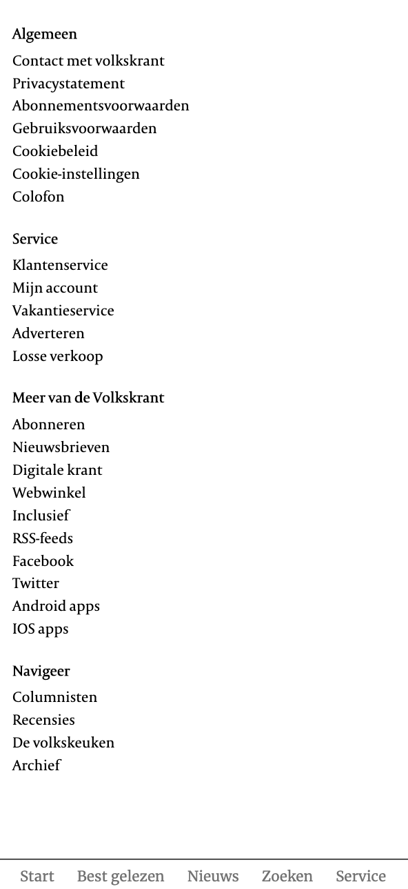
 

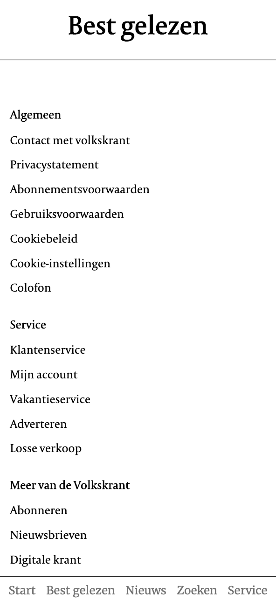

## Voortgang 3 (week 6)

### Stand van zaken
-

**Screenshots:**

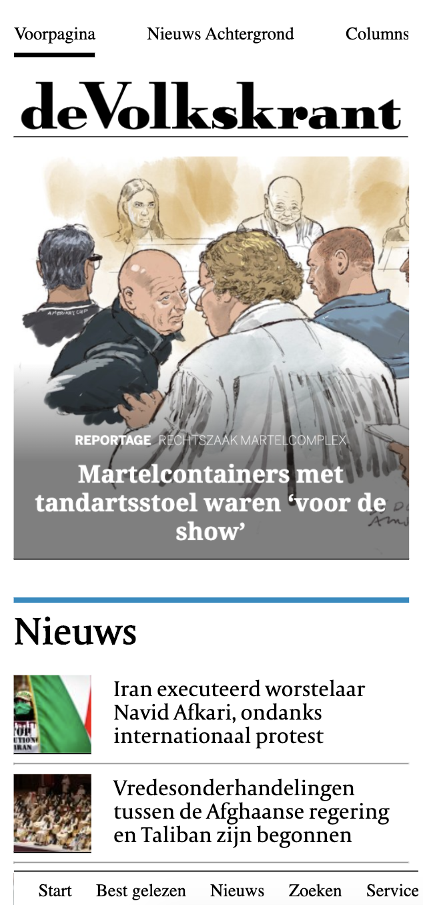
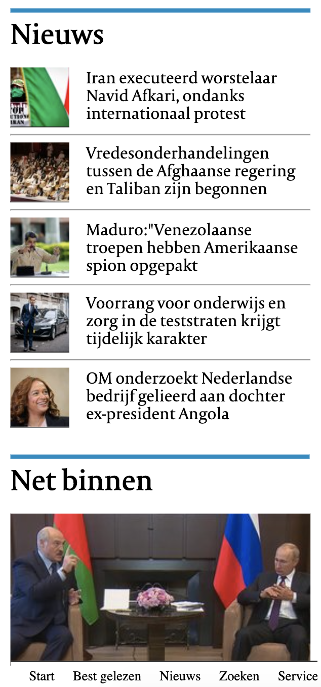
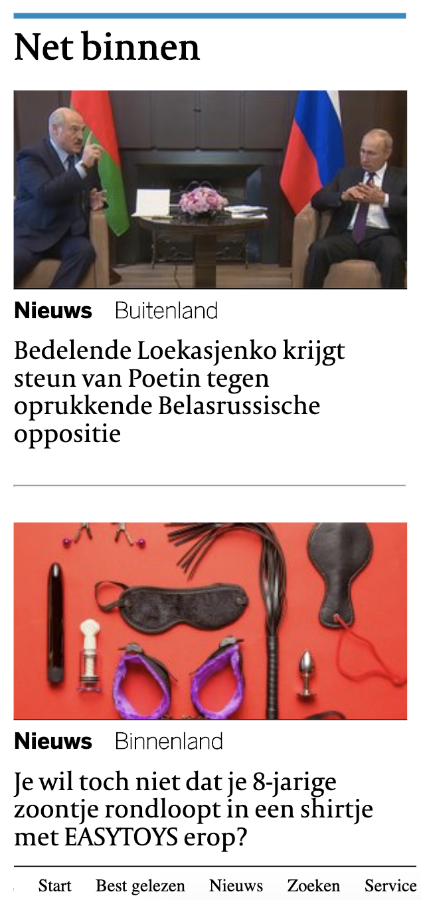
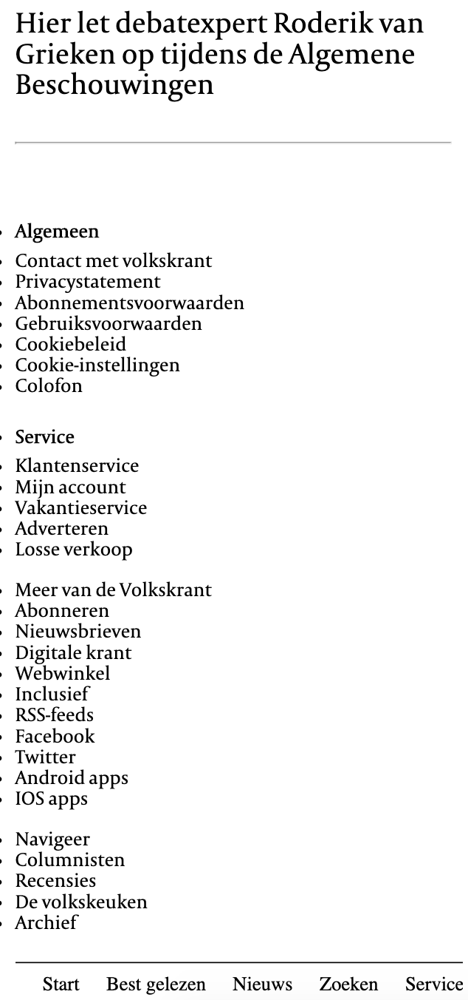

### Agenda voor meeting

-

### Verslag van meeting

-

## Voortgang 2 (week 5)

-

**Screenshots:**

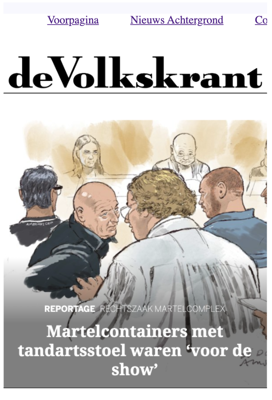
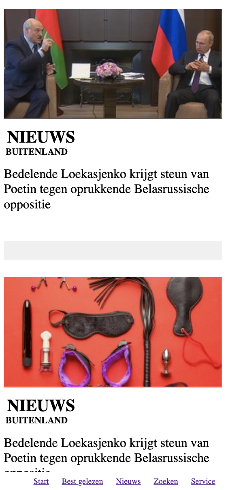
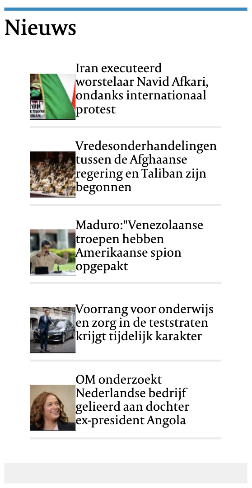
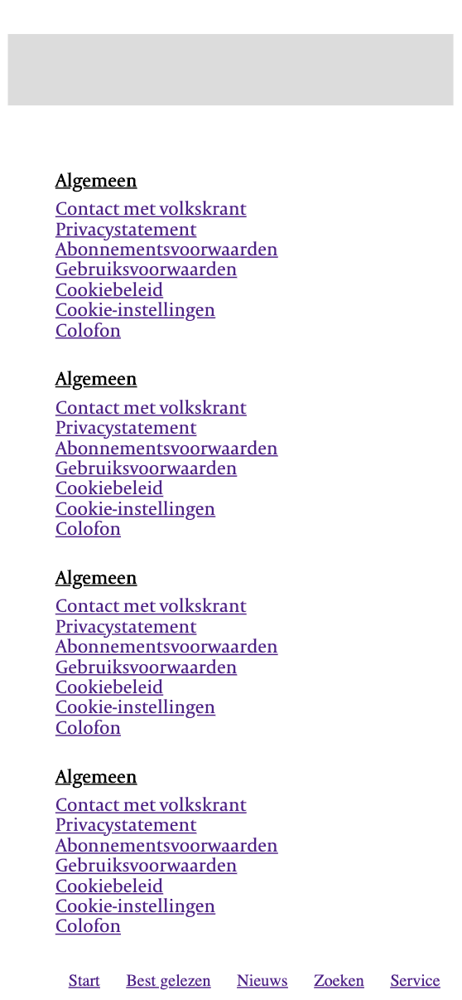

### Agenda voor meeting
-

### Verslag van meeting
-

## Voortgang 1 (week 3)
-

### Stand van zaken

-

**Screenshots:**

### Agenda voor meeting

-

### Verslag van meeting

-

## Intake (week 1)

**Je startniveau:** -blauw-

**Je focus:** -surface plane-

**Je opdracht:** -[De website:](https://www.volkskrant.nl/)-

**Screenshots:**

**Breakdown-schetsen:**

![-voorlopige breakdownschets(en) van een of beide pagina's van de site die je gaat maken-]

