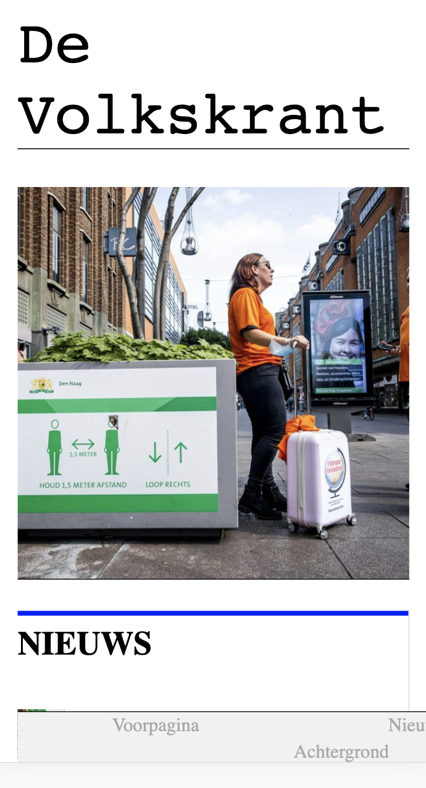
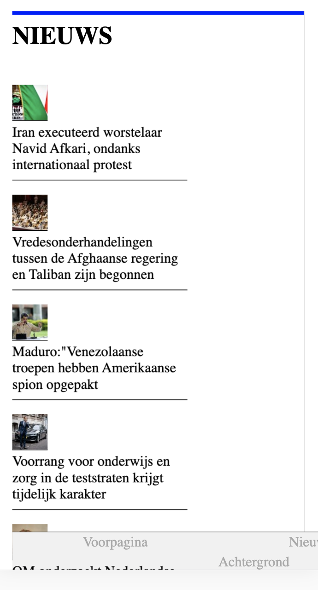
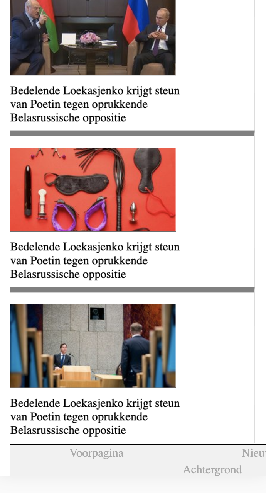
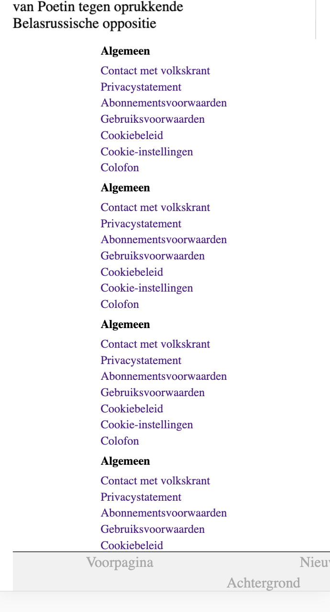
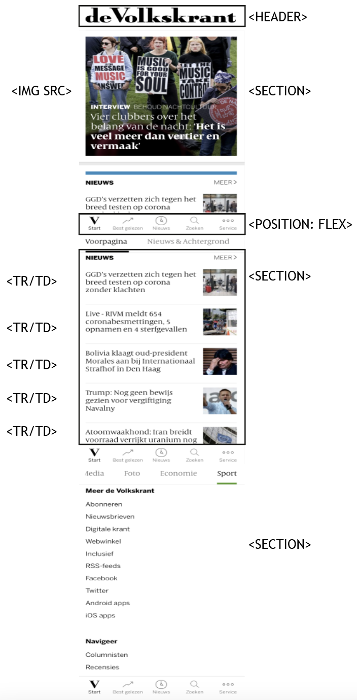

# Procesverslag
**Auteur:** -Pieter Buur-

Markdown cheat cheet: [Hulp bij het schrijven van Markdown](https://github.com/adam-p/markdown-here/wiki/Markdown-Cheatsheet). Nb. de standaardstructuur en de spartaanse opmaak zijn helemaal prima. Het gaat om de inhoud van je procesverslag. Besteedt de tijd voor pracht en praal aan je website.

Codepen: https://codepen.io/pieterbuur/pens/public?cursor=ZD0wJm89MSZwPTEmdj00NzE3MzIyNQ==

## Bronnenlijst
1. -bron 1-
2. -bron 2-
3. -...-

## Eindgesprek (week 7/8)

-dit ging goed & dit was lastig-

**Screenshot(s):**

-screenshot(s) van je eindresultaat-

## Voortgang 3 (week 6)

-same as voortgang 1-

## Voortgang 2 (week 5)

-dit ging goed & dit was lastig-

**Screenshot(s):**

-screenshot(s) van hoe ver je bent-

### Agenda voor meeting

### Verslag van meeting

## Voortgang 1 (week 3)

### Stand van zaken

-dit ging goed & dit was lastig-

**Screenshot(s):**

-screenshot(s) van hoe ver je bent-

### Agenda voor meeting

18 september groep B2, 9.25. Vanwege drukte met het hele groepje besloten de dag van de feedbackgesprekken zelf te doen.

### Verslag van meeting

Het feedbackgesprek ging goed, alleen er waren wel een paar punten van verbetering:

- Werk je icoontjes uit door de svg te kopiëren van volkskrant.nl
- Gebruik <strong> en <em> voor tekst
- Gebruik figures ipv img src voor de artikelen.
    
Het eerste waar ik nu mee aan de slag ga is de homepage verder stylen.

## Intake (week 1)

**Je startniveau:** -blauw-

**Je focus:** -responsive-

**Je opdracht:** -[De website:](https://www.volkskrant.nl/)-

**Screenshot(s):**

**Breakdown-schets(en):**

![-voorlopige breakdownschets(en) van een of beide pagina's van de site die je gaat maken-]

